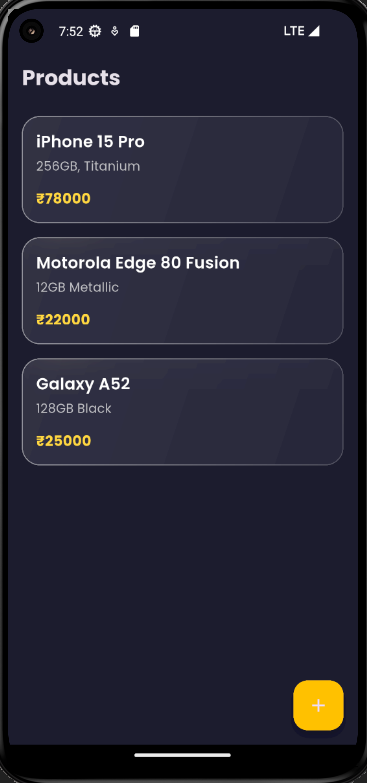
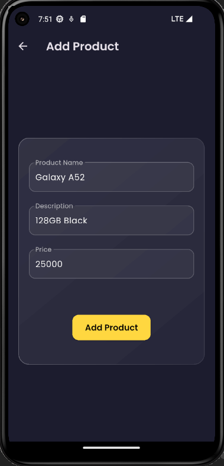
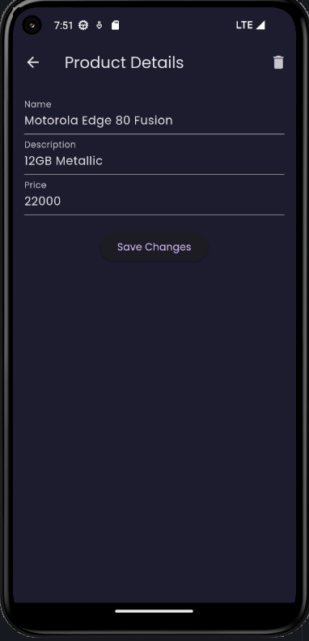

# 📦 Mobile-Store

A sleek and modern **Flutter + Node.js CRUD app** for managing products, styled and built using clean architecture and `Provider` for state management.

---

## 🚀 Features

- 🔍 **View Products** – Home screen fetches and lists all products.
- ➕ **Add Product** – Glassmorphic form UI to add new entries.
- 📝 **Edit Product** – Update product details with prefilled inputs.
- ❌ **Delete Product** – Confirmation dialog + instant removal.
- 📡 **Node.js API integration** – Uses RESTful routes (GET, POST, PUT, DELETE).
- 🧠 **Provider State Management** – Ensures reactive UI and clean logic separation.


---

## 🖼️ Screenshots

### 🏠 Home Screen
Displays the full product list using glass card UI with live updates.



### ➕ Add Product
Gorgeous frosted form interface with styled input fields and custom submit button.



### 📃 Product Details
Allows updating or deleting the product with seamless navigation.



---

## 🛠️ Tech Stack

| Layer         | Stack                                      |
|---------------|---------------------------------------------|
| **Frontend**  | Flutter + Provider + Google Fonts |
| **Backend**   | Node.js + Express + MongoDB (Mongoose)     |
| **API Calls** | HTTP package with async/await              |

---

## 📂 Folder Structure (Simplified)

```
lib/
├── providers/
│   └── product_provider.dart
├── screens/
│   ├── product_list_screen.dart
│   ├── add_product_screen.dart
│   └── product_detail_screen.dart
├── api_service.dart
└── main.dart
```

---

## 🔧 Setup Instructions

### 1. Clone the repo
```bash
git clone https://github.com/your-username/flutter-crud.git
cd flutter-crud
```

### 2. Install dependencies
```bash
flutter pub get
```

### 3. Connect Backend
Ensure your Node.js API is running at `http://10.0.2.2:3000/products`  
(For physical device: use `your_local_ip:3000/products`)

### 4. Run the app
```bash
flutter run
```

---

## 📈 Architecture Overview

| Screen                 | API Integration                    | State Management                        | Navigation                         |
|------------------------|------------------------------------|------------------------------------------|------------------------------------|
| **Home Screen**        | Fetch products (GET)               | Listens for updates                      | Navigates to Add / Detail screens  |
| **Add Product**        | Add product (POST)                 | Calls Provider to update list            | Navigates back to Home             |
| **Product Detail**     | View product (GET)                 | Uses Provider to fetch product           | Navigates to Edit / Home           |
| **Edit/Delete Screen** | Update (PUT) or Delete (DELETE)    | Calls Provider to update/remove product  | Navigates back to Home             |

---

## 📜 License

This project is open source and available under the [MIT License](LICENSE).
